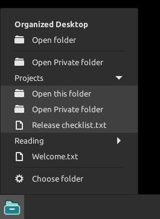
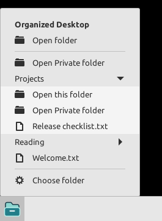
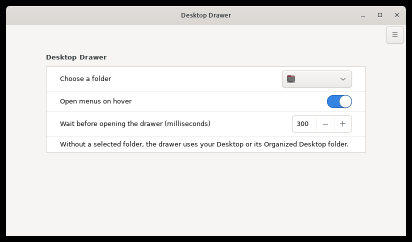
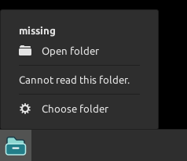
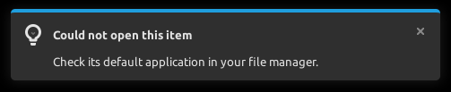

# Desktop Drawer

Keep your desktop tidy and your files within reach.

I download a lot of files, and my desktop ends up cluttered. I built Desktop
Drawer because I wanted to keep things organised without losing easy access
to my files and folders.

It's a small applet for the Cinnamon desktop. Put your files in a folder,
choose that folder in the drawer, and browse it from your panel whenever you
need something. You organise the files yourself; the drawer keeps them easy
to get to.

If your desktop fills up like mine, give it a try.

[Download the 1.2.0 beta](https://github.com/TitasDas/desktop-drawer/releases/download/v1.2.0/desktop-drawer-1.2.0.zip)

[Installation](#install) | [Tell me how it goes](https://github.com/TitasDas/desktop-drawer/issues/new/choose)

## See how it works

Here I'm showing the drawer with sample Projects and Reading folders. Hover
over the panel icon, browse a subfolder, and open a file in its usual app.
Use **Choose folder** to point the drawer at your own files.
[Watch or download the video](docs/media/desktop-drawer-demo.mp4).

The beta has been tested on Linux Mint with Cinnamon 6.0.5 and X11. It works
locally, with no account or extra runtime downloads. You'll need to install
it manually for now; it isn't on Cinnamon Spices yet.

## Give the clutter a home

You could start with a folder called `Organized Desktop`, move the files you
want to tidy into it, and choose it in the drawer. Add subfolders in whatever
way makes sense to you. You can also use a folder you already have, such as
your Downloads, notes or current project.

Once you've picked a folder, you can:

- Reach your project files, notes or reading material from the panel.
- Browse with hover, click or the keyboard.
- See which folder is open and change it directly from the menu.
- Keep filenames inside folders named Private out of the drawer.

<table>
<tr><th>Dark theme</th><th>Light theme</th></tr>
<tr>
<td></td>
<td></td>
</tr>
</table>

## Install

1. [Download desktop-drawer-1.2.0.zip](https://github.com/TitasDas/desktop-drawer/releases/download/v1.2.0/desktop-drawer-1.2.0.zip).
2. Open your Home folder. Press **Ctrl+H** to show hidden folders, then open
   `.local/share/cinnamon/applets`. Create any missing folders.
3. Extract the ZIP there. The resulting path should be
   `~/.local/share/cinnamon/applets/desktop-drawer@linux-automations/applet.js`.
4. Open Cinnamon **System Settings**, then **Applets**. Find **Desktop Drawer**
   in the installed applets list and add it to your panel.
5. Open the drawer and select **Choose folder**. Pick your notes, current project
   or another folder you use often.

If you already have a folder named `desktop-drawer@linux-automations`, remove
its applet from the panel and back up that folder before replacing it. Add it
back after extraction. This keeps the upgrade from mixing old and new files.

If you leave the folder unset, the drawer uses `Organized Desktop` inside your
Desktop folder when present, otherwise your Desktop folder.

## Set it up your way

Turn **Open menus on hover** off if you prefer clicking. Adjust how long the
pointer must rest over the panel icon before the drawer opens.

| Control | What it does |
|---|---|
| Click the panel icon | Open or close the drawer |
| Hover over the icon | Open after the configured delay, when enabled |
| Right and Left arrows | Open and close subfolders in left-to-right layouts |
| Enter | Open the selected file or folder |
| Escape | Close the drawer |
| Open folder | See the whole folder in your file manager |

## Private folders and your files

Folders named `Private`, ignoring capitalisation, are shown as **Open Private
folder**. Their contents stay out of the drawer, including inside subfolders.
They still open in your file manager. This is a display convenience, not a lock
or encryption.

Desktop Drawer does not move, rename, edit or delete your files. It does not
collect usage data. Cinnamon stores your chosen folder and preferences locally.
A network-mounted folder can use that filesystem's network connection.

The drawer shows up to 30 visible entries per folder and three folder levels.
Hidden files are omitted and directory symlinks are not expanded. For larger
folders, **Open folder** gives you the complete listing.

## When something goes wrong

If a folder was moved or a drive disconnected, **Choose folder** remains available.
If a file cannot open, the applet points you to its default application.

<table>
<tr><th>Folder unavailable</th><th>File could not open</th></tr>
<tr>
<td></td>
<td></td>
</tr>
</table>

See the [user guide](docs/USER-GUIDE.md) for empty folders, limits and removal.
To uninstall, remove the applet from your panel, then delete its directory from
`~/.local/share/cinnamon/applets/`. Your browsed files stay untouched.

## Tell me how it works for you

I built this to solve a problem I have. I'd like to hear whether it helps with
yours too, and where it gets in the way.

Try the [short beta checklist](packaging/desktop-drawer/BETA-CHECKLIST.md) and
[report what happened](https://github.com/TitasDas/desktop-drawer/issues/new/choose).
Please include your Cinnamon version and Linux distribution so I can understand
your setup. Use demo filenames in screenshots.

Automated checks cover menu interactions, keyboard activation, settings, folder
states and package rebuilds. Other Cinnamon versions, Wayland, assistive technology
and different display scales still need testing. See the
[validation record](packaging/desktop-drawer/VALIDATION.md) for the scope and limits.

## Want to help improve it?

Bug reports, translations and small fixes are welcome. You can also help by
trying it on your desktop and telling me what worked.

The applet is plain JavaScript using Cinnamon's built-in libraries.
[Build instructions](packaging/desktop-drawer/BUILD.md),
[contribution guide](CONTRIBUTING.md), and
[release notes](packaging/desktop-drawer/CHANGELOG.md) are included.
The repository contains only Desktop Drawer, not the larger automation suite.

## Licence

GPL-3.0-or-later. See [COPYING.md](COPYING.md) and [LICENSE](LICENSE).
Copyright (C) 2026 TitasDas.
